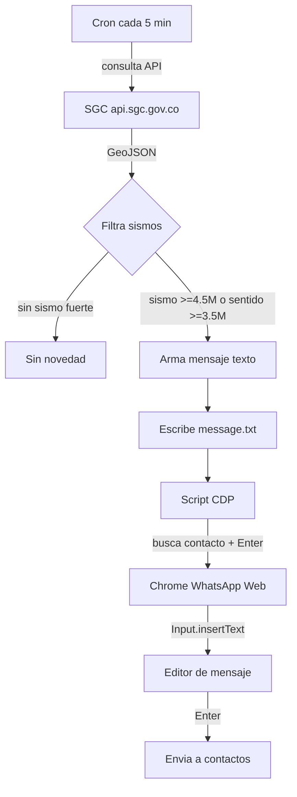
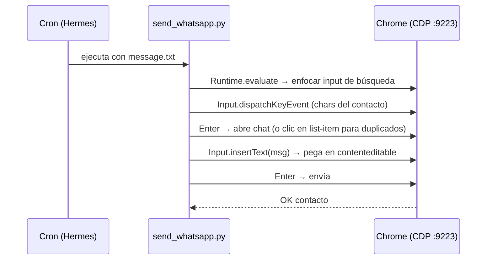

# WhatsApp Sismos Alerts

Automatización que envía **alertas de sismos de Colombia a contactos de WhatsApp** de forma autónoma. Cuando el **Servicio Geológico Colombiano (SGC)** registra un sismo fuerte o sentido, un cron arma el mensaje y lo entrega por WhatsApp Web usando **Chrome DevTools Protocol (CDP)**.

> **Privacidad:** la lista de destinatarios se mantiene en `recipients.json` (NO se sube al repo — ver `recipients.example.json`). Aquí solo se documenta la mecánica.

---

## 🔁 Cómo funciona



**Flujo de envío por contacto:**



---

## 📌 Por qué CDP y no pyautogui

La app de escritorio de WhatsApp **no se puede automatizar** con pyautogui: su ventana ignora el foco de teclado inyectado desde fuera (verificado: 0.00% de cambio al escribir). La vía fiable es **WhatsApp Web en un Chrome con CDP**, donde se controla el DOM/React directamente con eventos reales (`Input.dispatchKeyEvent` para buscar y `Input.insertText` para el editor — React ignora el setter virtual `input.value=`).

---

## 🚀 Setup

1. **Dependencias:**
   ```bash
   pip install -r requirements.txt
   ```

2. **Lanzar Chrome con WhatsApp Web vinculado** (una sola vez, en la sesión interactiva del usuario):
   ```bash
   chrome --remote-debugging-port=9223 --remote-allow-origins=* \
          --user-data-dir="C:\Users\<user>\.chrome-wa" "https://web.whatsapp.com"
   ```
   Escanear el QR desde el cel (WhatsApp → Dispositivos vinculados → Vincular dispositivo). Queda vinculado a ese perfil permanentemente.

3. **Configurar destinatarios** — copiar `recipients.example.json` → `recipients.json` y poner los contactos:
   ```json
   [
     {"query": "Nombre Contacto", "index": 0},
     {"query": "Nombre Duplicado", "index": 1}
   ]
   ```
   - `query`: texto a buscar en WhatsApp.
   - `index`: list-item a abrir (0 = primer resultado; úsalo para nombres duplicados).

4. **Enviar:**
   ```bash
   python send_whatsapp.py message.txt
   ```
   El script lee `message.txt` y envía a todos los destinatarios, imprimiendo `OK ...` por cada uno.

---

## 📁 Estructura

```
whatsapp-sismos-alerts/
├── send_whatsapp.py        # Script de envío vía CDP
├── recipients.example.json # Plantilla de destinatarios (sin datos reales)
├── requirements.txt        # websocket-client, pyautogui
└── README.md
```

**En producción (no subido):**
- `recipients.json` — lista real de contactos (privada)
- `message.txt` — mensaje generado por el cron de sismos
- `.chrome-wa` — perfil de Chrome de WhatsApp (vinculado)

---

## 🔒 Notas

- El envío requiere que el **Chrome de WhatsApp Web** esté corriendo. Si se cierra, el script reporta el error hasta reabrirlo.
- El umbral de alerta (≥4.5 M o sentido ≥3.5 M) lo decide el cron, no este script.
- Datos de sismos: propiedad del SGC, API público.
